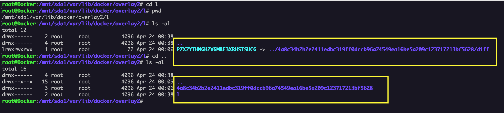

# Docker Images

Linux is built upon filesystem. That means everything is in the form of files and folders in linux. Whole operating system is basically a filesystem with files and folders stored on local disc storage. Docker is well known to be working on linux. That means the building block for container is in the form of files. Eventually docker image is the building block for docker container . 

Docker image is nothing but a layered file system. Each layer is stacked upon base layer. Each layer contains files and folder. This is to mention that docker uses unified file system. 

Docker images are just templates which drives the operations on container. Image is not a monolithic filesystem but it is divided into layer and each layer has files and folder. Layer is not mutable. No one can edit this layer which is the selling point of this docker. 

Lets explore the docker image. What is inside the docker image. 

To understand layering , pull a base image from docker hub registry. 

After running the command docker pull what exactly happened ?

Docker Stores all filesystem somewhere in the local system, you can find that information by inspecting the pulled docker image 

Cd to that /mnt/sda1/var/lib/docker/overlay2 

You can see a folder named “l”, my system shows one more but don’t worry I pulled same image twice that why it is showing new revision. We will come to this point later. 

lets Dig again and cd to that folder 

Wow, what is inside this folder , isn’t that looks similar to unix filesystem ? 

Yes , that unix filesystem from alpine flavor. This means when docker pulls the image , docker keeps filesystem of that base image in a deep location. This is nothing but keeping files and folders in short. 

We will see how is that get into action when containers is spun up. For now just understand how image is stored. 

If you try to make changes here in this filestrucure then consider that you broke everything . When docker image is pulled , it creates a symlink pointing to superlayer from the image. For every layer a symlink will be created pointing to the layer. 

Here till now we understood what exactly is docker image ? In which format image can be represented on local host. 

So what happens when container is spun up from this image. 

If you see the folder structure before spinning the container . Symlink is pointing to the raw folder structure. 

When docker engine spins a container from the image, it add an extra writable container layer upon all the layers when image layers have been loaded into the memory. 

