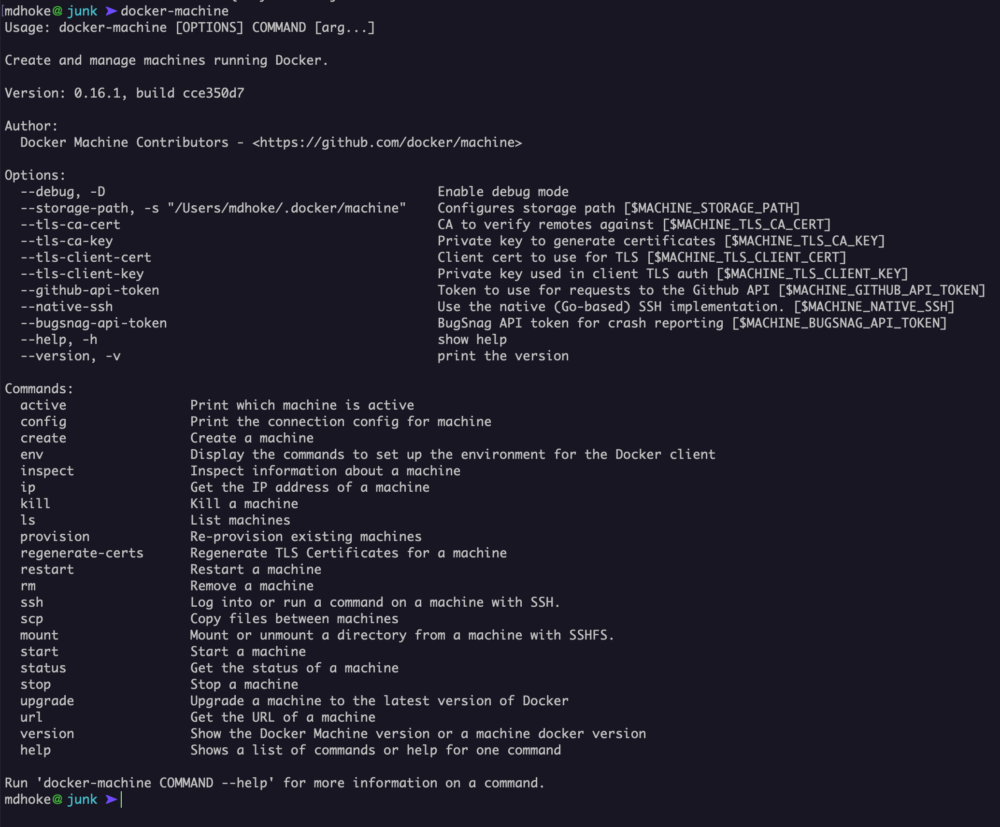
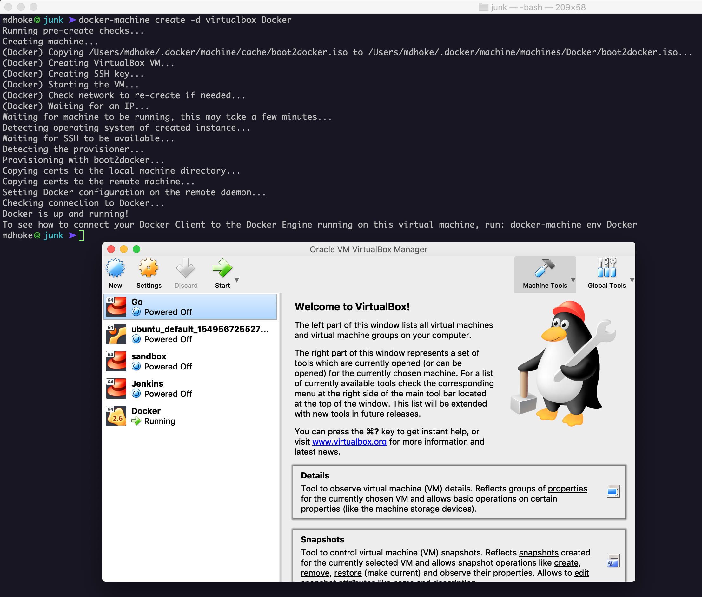

# Setting Environment

To understand the thing deeply it is best to play around with it. To understand the program it is best to write a code and make mistakes. Likewise to understand the docker lets play around it and dig it at every step.

You will have to install docker on the system first. This is not that difficult to do. You can follow docker installation guide from the official docker website. 

\( Ref: [https://docs.docker.com/v17.12/install/](https://docs.docker.com/v17.12/install/) \) 

Docker container run on the linux. Windows also provided the support for this also. To get a VM for docker to practice , we will use docker-machine. When you install docker on your local machine , docker toolbox will get installed. This tool is important for developers. Docker-Machine will create and manage the linux vm where docker is installed. In order to get VM, virtual box should be installed on your local machine. Install virtual box from the official website. 

docker-machine command output

Create a vm using docker-machine command 

Now you can see a vm named  is created in virtualbox 

Provide env to this vm and ssh to this vm using docker-machine command 

